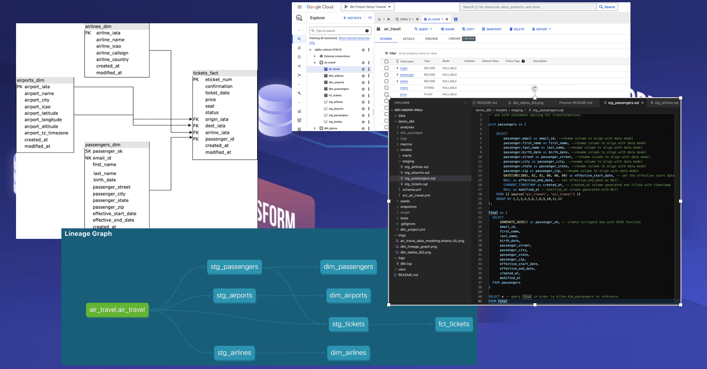
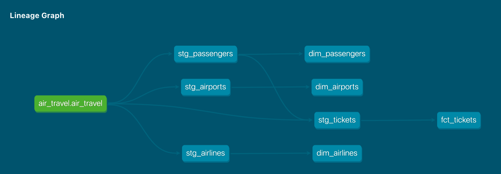
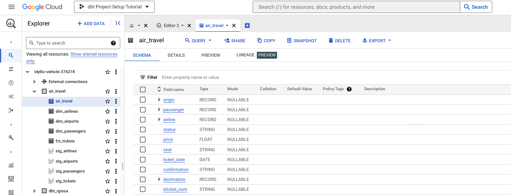

# dbt Data Modeling

#### By Ruben Giosa

#### This repo includes covers the same data modeling, loading, normalization exercise covered in my [data-modeling-cr](https://github.com/rgiosa10/data-modeling-cr) repository but leverages [dbt](https://www.getdbt.com/) instead. [Data Stack Academy](https://github.com/datastackacademy) will be incorporating my project into their dbt curriculum going forward. Below 



<br>

## Technologies Used

* Google BigQuery
* dbt
* SQL
* Jinja
* JSON
* Git
* Markdown
* `.gitignore`
* `requirements.txt`

</br>

## Description
This repo includes exercises for data modeling, loading and normalization for the processing of air travel tickets. Upon inspection of the main tickets source file: [`data/air_travel/tickets.json`](./data/air_travel/tickets.json) it includes json row records. Each record includes an issued flight ticket such as:

```json
{
  "eticket_num": "498-938211-0795",
  "confirmation": "ZVFDC4",
  "ticket_date": "2022-03-23",
  "price": 723.42,
  "seat": "31I",
  "status": "active",

  "airline": {
    "name": "China Eastern Airlines",
    "iata": "MU",
    "icao": "CES",
    "callsign": "CHINA EASTERN",
    "country": "China"
  },

  "origin": {
    "name": "Montreal / Pierre Elliott Trudeau International Airport",
    "city": "Montreal",
    "country": "Canada",
    "iata": "YUL",
    "icao": "CYUL",
    "latitude": 45.47,
    "longitude": -73.74,
    "altitude": 118,
    "tz_timezone": "America/Toronto"
  },

  "destination": {
    "name": "Chicago Midway International Airport",
    "city": "Chicago",
    "country": "United States",
    "iata": "MDW",
    "icao": "KMDW",
    "latitude": 41.79,
    "longitude": -87.75,
    "altitude": 620,
    "tz_timezone": "America/Chicago"
  },

  "passenger": {
    "first_name": "Robert",
    "last_name": "Brown",
    "gender": "M",
    "birth_date": "1969-02-17",
    "email": "robert.brown.69@hotmail.com",
    "street": "5007 Thomas Way",
    "city": "Lake Hollystad",
    "state": "DC",
    "zip": "20027"
  }
}
```

A ticket contains a few different entities:
- Ticket info: _e-ticket number, confirmation code, price, ..._
- Airline: _airline name, iata code, call sign, country, ..._
- Source and destination airports: _airport name, iata code, location, ..._
- Passengers: _passenger name, birth date, address_

<br><br>

In this exercise, the below are performed:
1. JSON file is loaded into BigQuery
1. Development of an ELT pipeline normalizing the source file into our facts and dimensions

<br><br>

## Exercise 1: Data Modeling

Using draw.io a data model (see below and also in main notebook), that meets the following requirements:

1. Contains a _tickets_ fact table
1. Contains the following dimensions: _airlines_, _airports_, and _passengers_
1. Develops _passengers_ as an SCD Type2 dimension:
    - Passenger email can be used as the natural key
    - Be sure to add a surrogate key and effective start/end dates
1. IATA codes can be used as the primary key for both _airlines_ and _airports_
1. Use the t-ticket number as the primary key for the _tickets_ fact

### Data Model:

<br>


<br><br>

## Exercise 2: Data Loading and Normalization

A ETL pipeline created that loads the dimensions and facts from the source file, and meets the following requirements:

**General**:
- Leverages dbt, SQL and Jinja to create ELT that creates the dim and facts outlined in the data model above. The below Lineage Graph shows to final ELT pipeline:



**Airlines Dim:**
- Identifies unique airlines
- Uses IATA code as the dimension key

**Airports Dim:**
- Identifies unique airports from both origin and destination fields
- Uses IATA code as the dimension key

**Passengers Dim:**
- Identifies unique passengers
- Uses the passenger email as the dimension natural key
- Uses UUIDs for the dimension surrogate keys
- Sets the effective start date to a fixed set date in the past
- Sets the effective end date to None
- Passenger address columns are considered SCD Type 2 columns
- All other columns are SCD Type 1

**Tickets Fact:**
- Links to _airlines_ and _airports_ dimensions by their IATA codes. 
- Links to the _passengers_ dimension by its surrogate key by performing a looking up to the _passengers_ dimension
- Loads all the tickets. See image below of dimension and fact tables loaded into BigQuery.



<br><br>

## Setup/Installation Requirements

* Go to https://github.com/rgiosa10/dbt-indpnt-proj.git to find the specific repository for this website.
* Then open your terminal. I recommend going to your Desktop directory:
    ```bash
    cd Desktop
    ```
* Then clone the repository by inputting: 
  ```bash
  git clone https://github.com/rgiosa10/dbt-indpnt-proj.git
  ```
* Go to the new directory or open the directory folder on your desktop:
  ```bash
  cd dbt-indpnt-proj
  ```
* Once in the directory you will need to set up a virtual environment in your terminal:
  ```bash
  python3.7 -m venv venv
  ```
* Then activate the environment:
  ```bash
  source venv/bin/activate
  ```
* `pip install` dbt with the BigQuery plugin:
```
pip install dbt-bigquery
```

* Check the version to make sure it succeeded:
```
dbt --version
```

In GitHub, create a new repository for this demo. Follow the directions on how to create a new repository on the command line:

```bash
# create a README
echo "dbt demo project" >> README.md

# initialize the git project
git init
git add README.md

# create a commit and push to remote
git commit -m "first commit"
git branch -M main
git remote add origin <URL_for_GitHub_repo>
git push -u origin main 
```

* Load the data files in the data folder to BigQuery under the project and create a dataset and table.

Now we'll initialize a dbt project. Let's call it "dbt_demo":

```bash
# initialize a dbt project
dbt init demo_dbt
```

* You'll see a series of prompts. Choose BigQuery, with 'service_account' as the authentication method. If you don't remember the path to your JSON key, use `echo $GOOGLE_APPLICATION_CREDENTIALS`. Enter your GCP project ID (`gcloud projects list` for reference).


* When you're done with the prompts, you'll see the message

```text
Profile demo_dbt written to /home/<user_name>/.dbt/profiles.yml using target's profile_template.yml and your supplied values. Run 'dbt debug' to validate the connection.
23:28:12  
Your new dbt project "demo_dbt" was created!
```

* Go into the newly created '.dbt' folder and take a look at the profile file. Then, run the usual `code .` to open VSCode.


* In your terminal, from within the `demo_dbt` directory, run `dbt debug`. This will check that the config files, dependencies, and connection to your BigQuery database are good to go. 

* Now you can run `dbt run`! (Again, make sure you're in the `demo_dbt` directory.) This will create a SQL table using the built-in demo models in the `demo_dbt/models/example/` folder, and the `air_travel` database on BigQuery. If you look at your BigQuery page now, you'll see the dbt tables there.

* With your virtual environment now enabled with proper requirements, open the directory:
  ```bash
  code .
  ```
* If there is interest to access or view the contents of this project on BigQuery and Looker please reach out and we can discuss getting access.

</br>

## Known Bugs

* No known bugs

<br>

## License

MIT License

Copyright (c) 2022 Ruben Giosa

Permission is hereby granted, free of charge, to any person obtaining a copy of this software and associated documentation files (the "Software"), to deal in the Software without restriction, including without limitation the rights to use, copy, modify, merge, publish, distribute, sublicense, and/or sell copies of the Software, and to permit persons to whom the Software is furnished to do so, subject to the following conditions:

The above copyright notice and this permission notice shall be included in all copies or substantial portions of the Software.

THE SOFTWARE IS PROVIDED "AS IS", WITHOUT WARRANTY OF ANY KIND, EXPRESS OR IMPLIED, INCLUDING BUT NOT LIMITED TO THE WARRANTIES OF MERCHANTABILITY, FITNESS FOR A PARTICULAR PURPOSE AND NONINFRINGEMENT. IN NO EVENT SHALL THE AUTHORS OR COPYRIGHT HOLDERS BE LIABLE FOR ANY CLAIM, DAMAGES OR OTHER LIABILITY, WHETHER IN AN ACTION OF CONTRACT, TORT OR OTHERWISE, ARISING FROM, OUT OF OR IN CONNECTION WITH THE SOFTWARE OR THE USE OR OTHER DEALINGS IN THE SOFTWARE.

</br>